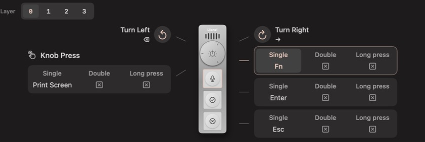
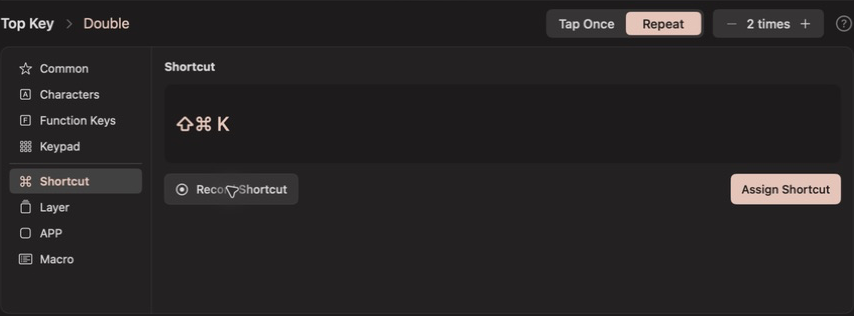
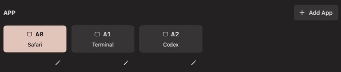

# Olanzi

**Open Ulanzi VibeKey AU-05 Driver —— Make VibeKey your own.**

A native macOS driver for **Ulanzi Vibe Key (AU05)** with a **VIA-style visual
keymap**. Customize its keys and knob, jump to apps, record macros, and build
four layers of shortcuts for your workflow.

> 🌐 [中文](README.zh.md)
>
> 📚 [Features](#features) · [Get started](#get-started) · [Development](#development) · [Documentation](#documentation)


*Screenshots show the actual native app in isolated demo mode with example
configurations. They do not represent a connected device or hardware verification.*

## Features

### A VIA-style configuration interface

If you use QMK/VIA keyboards, the layout will feel familiar: a visual device,
clickable keycaps, action categories, and a layer selector. Select a control
and gesture, choose an action, then **Save to This Mac**. Search the key library
by name or record a shortcut directly.

The layout covers **all six controls**: three keys, knob press, clockwise
rotation, and counterclockwise rotation. See each key's single, double, and
long-press assignments together, without opening a separate editor for every key.



### Custom keys, shortcuts, and gestures

Make each control useful for the way you work:

- **Assign keys and combinations.** Choose letters, symbols, navigation keys,
  function keys, modifiers, or Mac Fn. Record combinations with the keyboard.
- **Give a key more than one job.** The three keys and knob press each support
  single, double, and long presses. Both rotation directions have their own actions.
- **Choose how a key is sent.** Tap once, repeat 2–20 times, or hold where
  supported. Output settings are independent for each gesture.

For example, use a single press to copy, a double press to paste, and the knob
to move backward or forward through items. Edit a draft, try another mapping,
or discard your changes before saving.



### Jump to an app with one press

Assign an app to a key or gesture to bring it to the foreground. If it is not
running, Olanzi launches it first. Keep your editor, browser, terminal, or
chat app one press away.

Add a local app in **APP**, then assign its **A0**, **A1**, or later keycap.
The app library keeps these actions reusable across controls and layers.
App switching can also be the first step of a macro.



### Record and compose macros

Turn a sequence into one action: **switch to an app → wait → send a shortcut**.
A macro can combine application switches, keyboard combinations, and delays
in up to 32 ordered steps.

- **Record a sequence.** Capture multiple shortcuts continuously, optionally
  including the timing between them.
- **Edit visually.** Add, reorder, or remove steps and adjust delays.
- **Use QMK-style code.** Switch to Code view to edit the supported macro
  syntax, validate it, and return to the visual editor.
- **Reuse named macros.** Save a macro in the library and assign its **M0**,
  **M1**, or later keycap to different controls and gestures.


### Four layers for different workflows

Keep everyday shortcuts on **Layer 0** and build alternate layouts on
**Layers 1–3**. One layer might hold navigation keys, another editing
shortcuts, and another app actions or macros.

Assign **MO(1)** to a key to activate Layer 1 while it is held; release it to
return. Override only the actions you need. A **▽** inherits the action from
lower active layers, so shared shortcuts need not be configured again.
Clicking a layer number selects the layout to edit.


### Built for everyday use on macOS

- **Native and lightweight.** SwiftUI and AppKit provide the window and menu
  bar. The app communicates with the device directly and runs without Python,
  a browser, or a local server.
- **Profiles you can keep.** Save named setups for different tasks. Export and
  import JSON profiles to move your configuration between Macs.
- **Background operation.** Close the window and keep using your saved actions.
  The Dock icon hides when you close the window. Reopen it from the menu bar when you want to make a change.
- **Battery and idle controls.** See battery and charging status, choose an
  idle keepalive timeout, and resume from Settings or the menu bar. Pausing
  keepalive also pauses host layers, gestures, and macros.
- **English and Chinese.** Change the interface language immediately without
  losing your draft. Device controls, connection help, and profiles share one
  Settings page, also available with **⌘,**.
- **Try it without hardware.** Demo mode lets you explore the interface with
  simulated device data and temporary configurations.


## Get started

Requires **macOS 14 or later** and a **Vibe Key (AU05) with its USB receiver**.
The native app runs on its own, without Python, a browser, or a local server.

### Install the macOS app

1. Open a successful main-branch run of [Verify](https://github.com/MrCroxx/olanzi/actions/workflows/verify.yml?query=branch%3Amain).
2. Download **Olanzi-macOS-CI**, extract it, and open the DMG. Check that the
   architecture in the DMG filename matches your Mac.
3. Drag **Olanzi.app** into Applications and open it.
4. Enable **Input Monitoring** and **Accessibility** for Olanzi when prompted.
5. Quit Ulanzi Studio or other tools using the device, plug in the receiver,
   and turn on Vibe Key. Choose your actions and click **Save to This Mac**.

CI artifacts are retained for seven days and are ad-hoc signed, without Apple
notarization. If a build has expired or you need another architecture, build
locally using the commands below. See the [native app guide](docs/09-native-macos.md)
for installation, permissions, and signing.

### Your settings stay on your Mac

Normal edits save to `~/Library/Application Support/Olanzi/host-keymap.json`.
They do not rewrite the device's own key table. Use **Settings → Key Profiles** to save,
export, and import setups; after loading one, save it to activate it.
Olanzi needs to remain running for host actions to work. Automatic startup
at login is not configured.

### Device support

Olanzi currently supports **AU05 key and knob actions**. Lighting controls,
firmware updates, multimedia output, and other Ulanzi devices are not yet
supported in the app. Some advanced gesture and layer combinations still
need physical-device verification; see the [input runtime guide](docs/10-input-runtime.md)
for behavior and validation limits.

## Development

Requires a **Swift 6 toolchain** on macOS. From a checkout:

```bash
make dev
```

This builds and opens `build/Olanzi.app`. Quit any running copy first to use
the new build. To explore the interface without accessing hardware:

```bash
swift run --package-path native Olanzi --demo
```

Build an installer and run the checks:

```bash
make release
make test
make check-docs
```

The installer is written to `build/Olanzi-<version>-<arch>.dmg`. The build
uses a local signing identity when available; packaging does not install the
app. See [AGENTS.md](AGENTS.md) for contribution conventions.

## Documentation

- [Native macOS app](docs/09-native-macos.md) — setup, permissions, packaging, and background operation.
- [Input runtime](docs/10-input-runtime.md) — gestures, layers, macros, profiles, and validation limits.
- [Vibe Key protocol](docs/02-vibekey-protocol.md) — frames, encryption, and device commands.
- [Terminal tool](docs/03-tool-manual.md) — the standalone `vibekey.py` research tool.
- [Studio scope](docs/01-ulanzi-studio-scope.md), [methodology](docs/04-methodology.md), and [verification log](docs/05-verification-log.md) — reverse-engineering findings and evidence.
- [Heartbeat investigation](docs/07-heartbeat-investigation.md) and [Mac Fn](docs/08-mac-fn.md) — device behavior and host forwarding.
- [Legacy workspace](docs/06-local-workspace.md) — the earlier Python/browser prototype.

Olanzi is an independent project and is not affiliated with Ulanzi.
