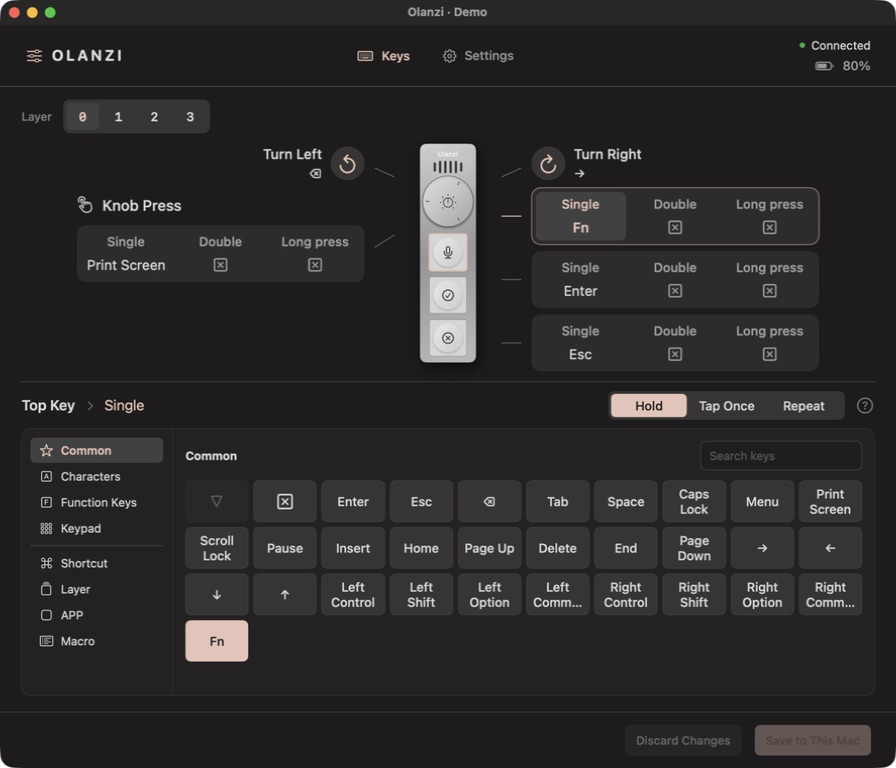
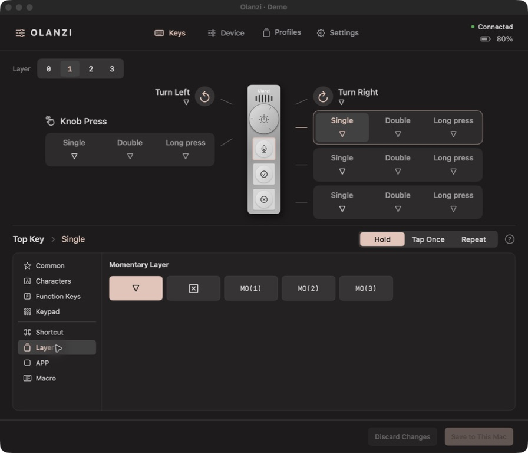
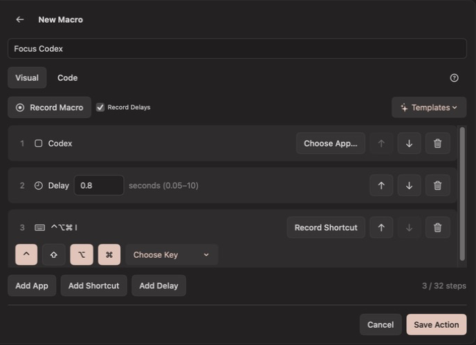
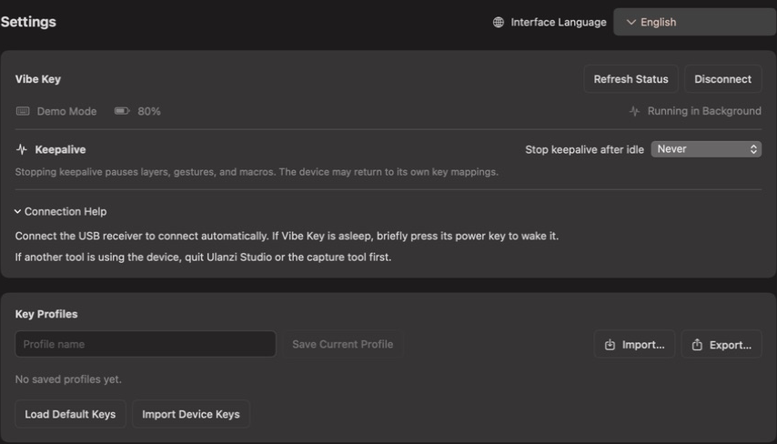

# Olanzi

**Open Ulanzi VibeKey AU-05 Driver —— Make VibeKey your own.**

A lightweight, native macOS companion for **Ulanzi Vibe Key (AU05)**.
Give its three keys and knob your own shortcuts, app switches, and macros,
with a visual keymap and a menu-bar app that stays out of the way.

> 🌐 [中文](README.zh.md)
>
> 📚 [Features](#features) · [Get started](#get-started) · [Development](#development) · [Documentation](#documentation)



*Screenshots show the actual native app in isolated demo mode with example
configurations. They do not represent a connected device or hardware verification.*

## Features

- **See your whole keymap.** Select a key, knob press, or rotation directly on
  the device layout. Pick from the key library or record a keyboard shortcut.
- **Do more with each key.** Assign separate single, double, and long presses.
  Keyboard actions can tap once, repeat a chosen number of times, or hold where supported.
- **Hold a key for another layer.** Four layers let the same controls serve
  different tasks. Override only what you need and inherit the rest.
- **Bring an app forward.** Assign an application to a key, launching it when
  needed. Keep reusable app actions in your library.
- **Turn a sequence into one action.** Record or compose macros that switch
  apps, send shortcuts, and wait between steps.
- **Keep your setups.** Save named profiles and export or import them as JSON
  when moving between Macs.
- **Stay in the menu bar.** Close the window and keep your mappings active.
  Check battery status, set an idle timeout, and choose English or Simplified Chinese.

### A keymap you can see

All six controls sit around the device: three keys, knob press, and both
rotation directions. Click a gesture to edit it, then **Save to This Mac**
when you are ready. Fn, navigation keys, function keys, and recorded
combinations are available in the same picker.

### One device, four layers

Keep everyday actions on Layer 0 and use Layers 1–3 for another set of
shortcuts. Assign **MO(1)** to a key to activate Layer 1 while it is held;
release it to return. A downward triangle means the action is inherited.
Clicking a layer number previews it for editing.



### Shortcuts that span apps

Build a macro from app switches, keyboard combinations, and delays. Record
several shortcuts in order, adjust the steps visually, or edit the supported
QMK-style syntax in Code view. Named actions can be reused across your keymap.



<details>
<summary><strong>Device and app settings</strong></summary>

Open **Settings** for language, device status, keepalive, connection help,
and saved profiles in one place. Connection help is expanded by default.

See battery and charging status at a glance. Choose when to stop keepalive
after the device is idle, or leave it on. When keepalive pauses, host layers,
gestures, and macros pause too; resume from Settings or the menu bar.
Closing the window keeps Olanzi running; quitting stops it.



</details>

## Get started

Requires **macOS 14 or later** and a **Vibe Key (AU05) with its USB receiver**.
The native app runs on its own, without Python, a browser, or a local server.

### Install the macOS app

1. Open a successful main-branch run of [Verify](https://github.com/MrCroxx/olanzi/actions/workflows/verify.yml?query=branch%3Amain).
2. Download **Olanzi-macOS-CI**, extract it, and open the DMG. Check that the
   architecture in the DMG filename matches your Mac.
3. Drag **Olanzi.app** into Applications and open it.
4. Enable **Input Monitoring** and **Accessibility** for Olanzi when prompted.
5. Quit Ulanzi Studio or other tools using the device, plug in the receiver,
   and turn on Vibe Key. Choose your actions and click **Save to This Mac**.

CI artifacts are retained for seven days and are ad-hoc signed, without Apple
notarization. If a build has expired or you need another architecture, build
locally using the commands below. See the [native app guide](docs/09-native-macos.md)
for installation, permissions, and signing.

### Your settings stay on your Mac

Normal edits save to `~/Library/Application Support/Olanzi/host-keymap.json`.
They do not rewrite the device's own key table. Use **Settings → Key Profiles** to save,
export, and import setups; after loading one, save it to activate it.
Olanzi needs to remain running for host actions to work. Automatic startup
at login is not configured.

### Device support

Olanzi currently supports **AU05 key and knob actions**. Lighting controls,
firmware updates, multimedia output, and other Ulanzi devices are not yet
supported in the app. Some advanced gesture and layer combinations still
need physical-device verification; see the [input runtime guide](docs/10-input-runtime.md)
for behavior and validation limits.

## Development

Requires a **Swift 6 toolchain** on macOS. From a checkout:

```bash
make dev
```

This builds and opens `build/Olanzi.app`. Quit any running copy first to use
the new build. To explore the interface without accessing hardware:

```bash
swift run --package-path native Olanzi --demo
```

Build an installer and run the checks:

```bash
make release
make test
make check-docs
```

The installer is written to `build/Olanzi-<version>-<arch>.dmg`. The build
uses a local signing identity when available; packaging does not install the
app. See [AGENTS.md](AGENTS.md) for contribution conventions.

## Documentation

- [Native macOS app](docs/09-native-macos.md) — setup, permissions, packaging, and background operation.
- [Input runtime](docs/10-input-runtime.md) — gestures, layers, macros, profiles, and validation limits.
- [Vibe Key protocol](docs/02-vibekey-protocol.md) — frames, encryption, and device commands.
- [Terminal tool](docs/03-tool-manual.md) — the standalone `vibekey.py` research tool.
- [Studio scope](docs/01-ulanzi-studio-scope.md), [methodology](docs/04-methodology.md), and [verification log](docs/05-verification-log.md) — reverse-engineering findings and evidence.
- [Heartbeat investigation](docs/07-heartbeat-investigation.md) and [Mac Fn](docs/08-mac-fn.md) — device behavior and host forwarding.
- [Legacy workspace](docs/06-local-workspace.md) — the earlier Python/browser prototype.

Olanzi is an independent project and is not affiliated with Ulanzi.
