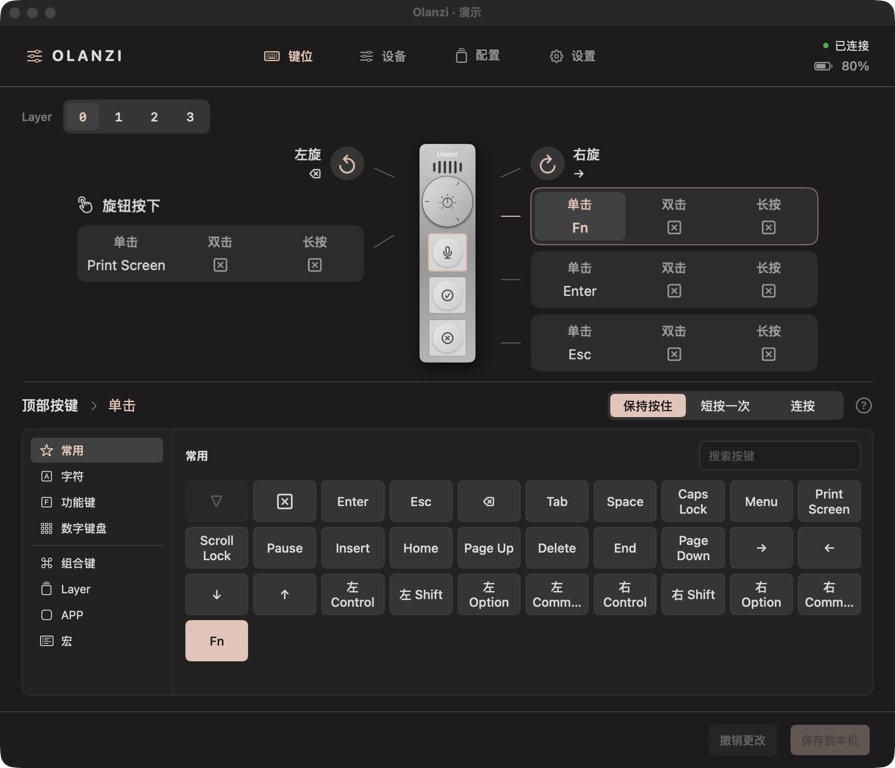
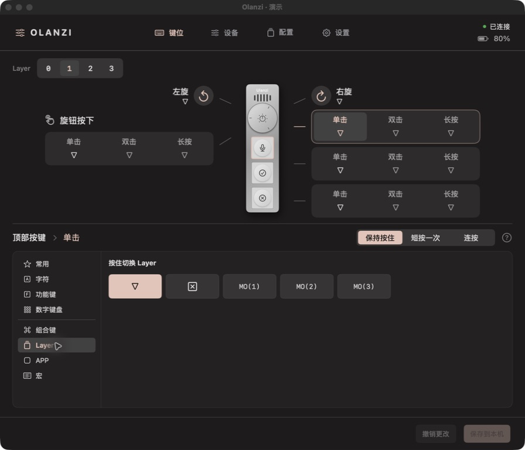
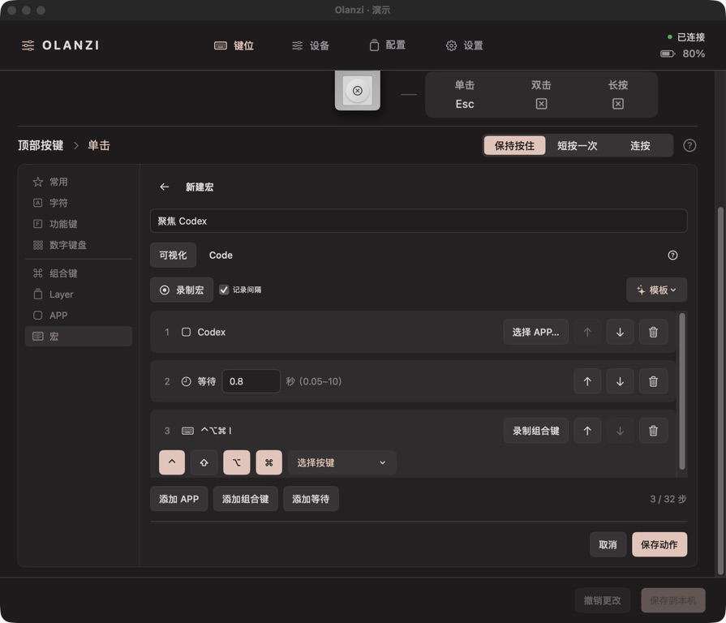
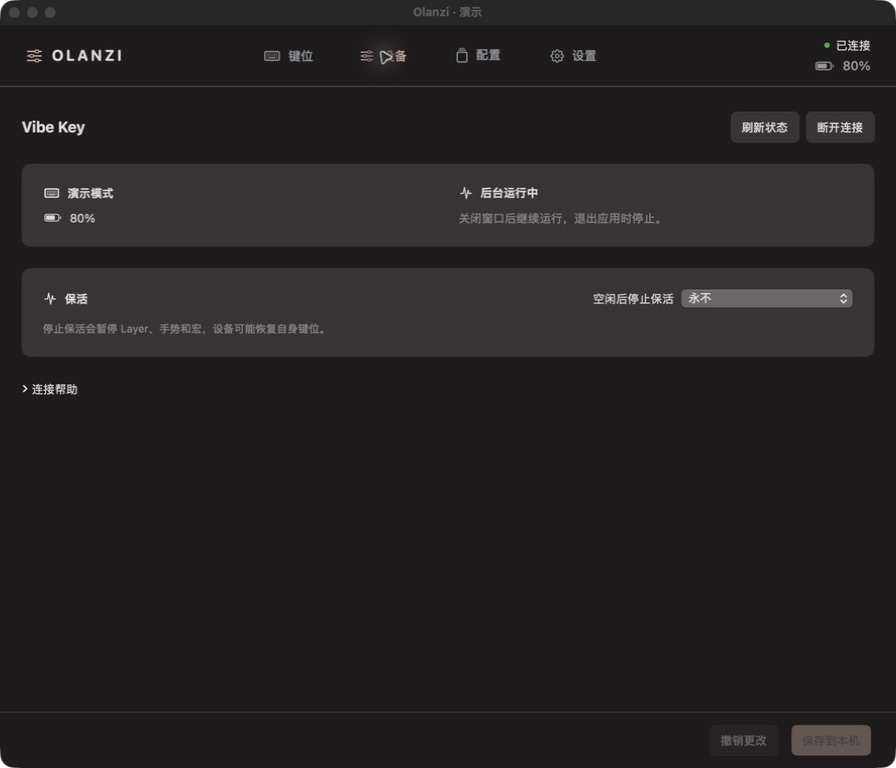

# Olanzi

**让 Vibe Key 按你的习惯工作。**

为 **Ulanzi Vibe Key（AU05）** 打造的轻量原生 macOS 应用。
给三个按键和旋钮分配自己的快捷键、应用切换和宏，
在可视化界面中完成设置，日常使用交给菜单栏里的 Olanzi。

> 🌐 [English](README.md)
>
> 📚 [功能](#功能) · [开始使用](#开始使用) · [开发](#开发) · [文档](#文档)



*截图来自原生应用的隔离演示模式，使用示例配置；
不表示已连接真实设备，也不作为硬件验证证据。*

## 功能

- **一眼看清全部键位。** 在设备布局上选择按键、旋钮按下或旋转方向，
  从按键库中选择动作，也可以直接录制组合键。
- **一个按键，多种用法。** 分别设置单击、双击和长按。
  键盘动作可短按一次、连按指定次数，或在支持时保持按住。
- **按住切换另一层。** 四层键位让同一组控件适应不同任务，
  只改需要的动作，其余沿用底层。
- **一键切到应用。** 为按键指定应用，未运行时自动启动。
  常用的应用动作可以保存在动作库里反复使用。
- **把一串操作变成一个动作。** 录制或编排宏，
  按顺序切换应用、发送组合键，并在步骤之间等待。
- **保存不同场景的配置。** 为配置命名保存，
  换一台 Mac 时通过 JSON 导出、导入。
- **留在菜单栏里。** 关闭窗口后键位继续生效。
  随时查看电量、设置空闲超时，并选择中文或英文界面。

### 看得见的键位

六个控件围绕设备排列：三个按键、旋钮按下，以及左右旋转。
点击一种手势即可编辑，准备好后点击 **保存到本机**。
Fn、导航键、功能键和录制的组合键都在同一个选择器中。

### 一个设备，四层键位

Layer 0 放日常动作，Layer 1–3 放另一组快捷键。
把 **MO(1)** 分配给按键，按住时启用 Layer 1，松开恢复。
倒三角表示沿用底层动作；点击层编号只是切换编辑预览。



### 跨应用的一串操作

用应用切换、组合键和等待步骤组成宏。可以连续录制多组快捷键，
在可视化编辑器中调整步骤，也可以在代码视图中编辑受支持的
QMK 风格语法。命名后的动作可以在多处键位中复用。



<details>
<summary><strong>电量与后台运行</strong></summary>

随时查看电量和充电状态。可以设置设备空闲多久后停止保活，
也可以一直保持。保活暂停后，本机 Layer、手势和宏也会暂停，
可从设备页或菜单栏恢复。关闭窗口后 Olanzi 继续运行，退出应用才会停止。



</details>

## 开始使用

需要 **macOS 14 或更新版本**，以及 **Vibe Key（AU05）和 USB 接收器**。
原生应用独立运行，无需 Python、浏览器或本地服务器。

### 安装 macOS 应用

1. 打开一次成功的 main 分支 [Verify](https://github.com/MrCroxx/olanzi/actions/workflows/verify.yml?query=branch%3Amain) 构建。
2. 下载 **Olanzi-macOS-CI**，解压后打开 DMG。确认 DMG 文件名中的
   架构与你的 Mac 一致。
3. 将 **Olanzi.app** 拖入 Applications 并打开。
4. 按提示为 Olanzi 开启 **输入监控** 和 **辅助功能** 权限。
5. 退出 Ulanzi Studio 等占用设备的工具，插入接收器并开启 Vibe Key。
   选择动作，点击 **保存到本机**。

CI 构建产物保留七天，使用临时签名，未经 Apple 公证。
如果产物已过期或需要其他架构，可以按下方命令在本机构建。
安装、权限与签名说明见 [原生应用指南](docs/09-native-macos.zh.md)。

### 配置保存在你的 Mac 上

日常编辑保存到 `~/Library/Application Support/Olanzi/host-keymap.json`，
不会改写设备自身的按键表。在 **配置** 页保存、导出和导入不同方案；
载入后还需保存到本机才会生效。使用本机动作时需要保持 Olanzi 运行。
应用目前不会自动设置开机启动。

### 设备支持

目前支持 **AU05 的按键与旋钮动作**。应用暂不支持灯光控制、
固件更新、多媒体输出或其他 Ulanzi 设备。
部分进阶手势与多层组合仍待真实设备验证；具体行为和验证边界见
[输入运行时指南](docs/10-input-runtime.zh.md)。

## 开发

需要 macOS 和 **Swift 6 工具链**。在仓库根目录执行：

```bash
make dev
```

这会构建并打开 `build/Olanzi.app`。如有旧实例运行，请先退出，
以便启动新版本。不连接硬件也能体验界面：

```bash
swift run --package-path native Olanzi --demo
```

构建安装包并运行检查：

```bash
make release
make test
make check-docs
```

安装包输出到 `build/Olanzi-<version>-<arch>.dmg`。
构建时会优先使用本机可用的签名身份；打包不会自动安装应用。
贡献约定见 [AGENTS.md](AGENTS.md)。

## 文档

- [原生 macOS 应用](docs/09-native-macos.zh.md) — 安装、权限、打包和后台运行。
- [输入运行时](docs/10-input-runtime.zh.md) — 手势、Layer、宏、配置与验证边界。
- [Vibe Key 协议](docs/02-vibekey-protocol.zh.md) — 帧、加密与设备命令。
- [终端工具](docs/03-tool-manual.zh.md) — 独立的 `vibekey.py` 研究工具。
- [Studio 职责边界](docs/01-ulanzi-studio-scope.zh.md)、[逆向方法论](docs/04-methodology.zh.md)与[验证记录](docs/05-verification-log.zh.md) — 逆向发现及原始证据。
- [心跳调查](docs/07-heartbeat-investigation.zh.md)与 [Mac Fn](docs/08-mac-fn.zh.md) — 设备行为与本机转发。
- [早期工作区](docs/06-local-workspace.zh.md) — 保留的 Python / 浏览器原型。

Olanzi 是独立项目，与 Ulanzi 无隶属关系。
