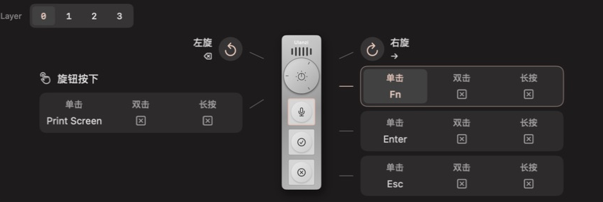
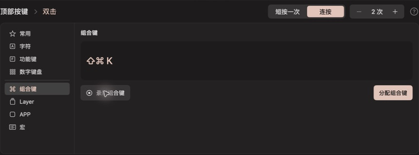
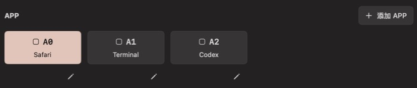

# Olanzi

**Open Ulanzi VibeKey AU-05 Driver —— Make VibeKey your own.**

为 **Ulanzi Vibe Key（AU05）** 打造的原生 macOS 驱动，提供 **VIA 风格的可视化键位配置**。
自定义按键与旋钮、一键跳转 App、录制宏，再用四层键位组织你的常用操作。

> 🌐 [English](README.md)
>
> 📚 [功能](#功能) · [开始使用](#开始使用) · [开发](#开发) · [文档](#文档)


*截图来自原生应用的隔离演示模式，使用示例配置；
不表示已连接真实设备，也不作为硬件验证证据。*

## 功能

### VIA 风格的可视化配置界面

如果你用过 QMK/VIA 键盘，这套界面会很熟悉：设备示意图、可点击的键帽、
动作分类和 Layer 选择器。选中控件与手势，选择动作，再点击 **保存到本机**。
可以按名称搜索按键，也可以直接用键盘录制组合键。

界面覆盖 **全部六个控件**：三个按键、旋钮按下、顺时针旋转和逆时针旋转。
每个按键的单击、双击和长按分配同时可见，无需逐个打开独立编辑器查看。



### 自定义按键、组合键与手势

让每个控件都适合你的使用习惯：

- **分配按键与组合键。** 从字母、符号、导航键、功能键、修饰键和 Mac Fn 中选择，
  也可以直接用键盘录制组合键。
- **一个按键，多种动作。** 三个按键和旋钮按下都支持单击、双击、长按，
  左右旋转也可以分别设置动作。
- **选择按键的输出方式。** 短按一次、连按 2–20 次，或在支持时保持按住。
  每种手势的输出方式都可以单独设置。

例如，单击复制、双击粘贴，旋钮左右转动切换上一项和下一项。
修改先保留为草稿，可以继续调整，也可以在保存前撤销更改。



### 一键跳转 App

把应用分配给按键或手势，按一下就能切到前台；应用尚未运行时，Olanzi 会先启动它。
编辑器、浏览器、终端和聊天应用，都可以放到顺手的位置。

在 **APP** 分类中添加本地应用，再分配对应的 **A0**、**A1** 等键帽。
应用动作保存在库中，可以跨控件、跨 Layer 复用，也可以作为宏的第一步。



### 录制与编排宏

把一串操作变成一个动作：**切换应用 → 等待 → 发送组合键**。
一个宏最多包含 32 个有序步骤，可以混合应用切换、组合键和等待。

- **连续录制。** 一次录下多组快捷键，也可以保留操作之间的时间间隔。
- **可视化编辑。** 添加、调整顺序或删除步骤，修改等待时间。
- **QMK 风格代码。** 切到 Code 视图编辑受支持的宏语法，校验后可返回可视化编辑器。
- **命名并复用。** 将宏保存到动作库，通过 **M0**、**M1** 等键帽分配给不同控件和手势。


### 四层键位，适应不同工作场景

**Layer 0** 放日常快捷键，**Layer 1–3** 放其他布局。
一层用于导航，一层用于编辑，另一层放 App 跳转和宏，同一组控件可以承担不同任务。

给按键分配 **MO(1)**，按住时启用 Layer 1，松开即恢复。
只覆盖需要变化的动作；**▽** 表示沿用较低活动层的动作，共用快捷键不用重复设置。
点击层编号即可选择要编辑的布局。


### 适合日常使用的 macOS 应用

- **原生、轻量。** 使用 SwiftUI 和 AppKit 构建窗口与菜单栏，直接与设备通信，
  无需 Python、浏览器或本地服务器。
- **保存不同配置。** 为不同任务保存命名方案，通过 JSON 导出、导入，换一台 Mac 也能继续使用。
- **后台运行。** 关闭窗口后继续使用已保存的动作，需要修改时从菜单栏或 Dock 重新打开。
- **电量与空闲控制。** 查看电量和充电状态，设置空闲多久后停止保活，
  从设置页或菜单栏恢复。保活暂停时，本机 Layer、手势和宏也会暂停。
- **中英文界面。** 即时切换语言，不丢失当前草稿。设备控制、连接帮助和键位配置集中在同一设置页，
  按 **⌘,** 即可打开。
- **没有设备也能体验。** 演示模式使用模拟设备数据和临时配置，可以先熟悉整个界面。


## 开始使用

需要 **macOS 14 或更新版本**，以及 **Vibe Key（AU05）和 USB 接收器**。
原生应用独立运行，无需 Python、浏览器或本地服务器。

### 安装 macOS 应用

1. 打开一次成功的 main 分支 [Verify](https://github.com/MrCroxx/olanzi/actions/workflows/verify.yml?query=branch%3Amain) 构建。
2. 下载 **Olanzi-macOS-CI**，解压后打开 DMG。确认 DMG 文件名中的
   架构与你的 Mac 一致。
3. 将 **Olanzi.app** 拖入 Applications 并打开。
4. 按提示为 Olanzi 开启 **输入监控** 和 **辅助功能** 权限。
5. 退出 Ulanzi Studio 等占用设备的工具，插入接收器并开启 Vibe Key。
   选择动作，点击 **保存到本机**。

CI 构建产物保留七天，使用临时签名，未经 Apple 公证。
如果产物已过期或需要其他架构，可以按下方命令在本机构建。
安装、权限与签名说明见 [原生应用指南](docs/09-native-macos.zh.md)。

### 配置保存在你的 Mac 上

日常编辑保存到 `~/Library/Application Support/Olanzi/host-keymap.json`，
不会改写设备自身的按键表。在 **设置 → 键位配置** 中保存、导出和导入不同方案；
载入后还需保存到本机才会生效。使用本机动作时需要保持 Olanzi 运行。
应用目前不会自动设置开机启动。

### 设备支持

目前支持 **AU05 的按键与旋钮动作**。应用暂不支持灯光控制、
固件更新、多媒体输出或其他 Ulanzi 设备。
部分进阶手势与多层组合仍待真实设备验证；具体行为和验证边界见
[输入运行时指南](docs/10-input-runtime.zh.md)。

## 开发

需要 macOS 和 **Swift 6 工具链**。在仓库根目录执行：

```bash
make dev
```

这会构建并打开 `build/Olanzi.app`。如有旧实例运行，请先退出，
以便启动新版本。不连接硬件也能体验界面：

```bash
swift run --package-path native Olanzi --demo
```

构建安装包并运行检查：

```bash
make release
make test
make check-docs
```

安装包输出到 `build/Olanzi-<version>-<arch>.dmg`。
构建时会优先使用本机可用的签名身份；打包不会自动安装应用。
贡献约定见 [AGENTS.md](AGENTS.md)。

## 文档

- [原生 macOS 应用](docs/09-native-macos.zh.md) — 安装、权限、打包和后台运行。
- [输入运行时](docs/10-input-runtime.zh.md) — 手势、Layer、宏、配置与验证边界。
- [Vibe Key 协议](docs/02-vibekey-protocol.zh.md) — 帧、加密与设备命令。
- [终端工具](docs/03-tool-manual.zh.md) — 独立的 `vibekey.py` 研究工具。
- [Studio 职责边界](docs/01-ulanzi-studio-scope.zh.md)、[逆向方法论](docs/04-methodology.zh.md)与[验证记录](docs/05-verification-log.zh.md) — 逆向发现及原始证据。
- [心跳调查](docs/07-heartbeat-investigation.zh.md)与 [Mac Fn](docs/08-mac-fn.zh.md) — 设备行为与本机转发。
- [早期工作区](docs/06-local-workspace.zh.md) — 保留的 Python / 浏览器原型。

Olanzi 是独立项目，与 Ulanzi 无隶属关系。
